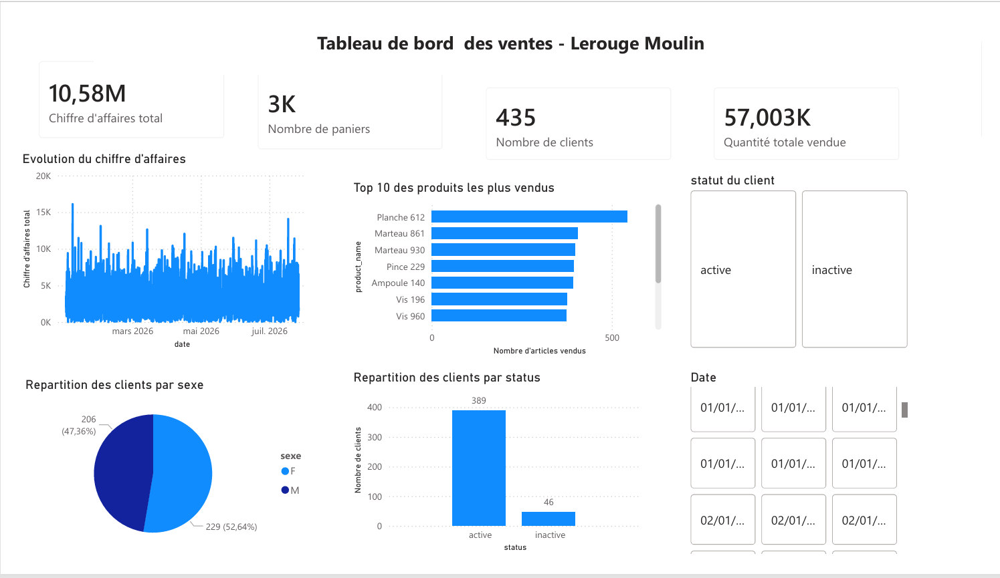

# Retail Data Engineering Pipeline

Pipeline de Data Engineering de bout en bout pour l'intégration, le contrôle qualité, la transformation et l'analyse de données commerciales issues de sources hétérogènes.

Le projet couvre l'ensemble de la chaîne de traitement : **ingestion CSV/XML, ETL Python, Data Quality, modélisation relationnelle, stockage SQLite, analyse SQL, visualisation Power BI et automatisation sur AWS EC2**.

---

## Objectif du projet

Les données de l'entreprise fictive **Lerouge Moulin** sont réparties entre plusieurs sources CSV et XML contenant des informations sur les clients, les produits et les transactions.

L'objectif est de construire une chaîne de traitement permettant de :

- centraliser des données provenant de plusieurs sources ;
- harmoniser et transformer les données ;
- détecter automatiquement les anomalies de qualité ;
- construire un modèle de données relationnel cohérent ;
- charger les données validées dans une base SQLite ;
- produire des données exploitables pour l'analyse ;
- construire un tableau de bord Power BI ;
- automatiser l'exécution du pipeline sur une instance AWS EC2.

---

## Architecture du pipeline

```text
                    DONNÉES SOURCES
                          │
          ┌───────────────┼───────────────┐
          │               │               │
         XML             CSV             CSV
          │               │               │
          └───────────────┼───────────────┘
                          ▼
                 Extraction Python
                          │
                          ▼
               Conversion des types
                          │
                          ▼
             Nettoyage & Transformation
                          │
                          ▼
                Contrôles qualité
                          │
             ┌────────────┴────────────┐
             │                         │
      Anomalie bloquante          Données valides
             │                         │
             ▼                         ▼
      Rapport qualité          CSV + Base SQLite
                                       │
                                       ▼
                                Analyse / Power BI
```

Le pipeline a également été déployé et testé sur **AWS EC2 (Ubuntu)** avec une exécution planifiée via **cron** et une journalisation des traitements.

---

## Sources de données

Le pipeline intègre quatre fichiers sources :

| Source | Format | Contenu |
|---|---|---|
| `client.xml` | XML | Informations clients |
| `product.csv` | CSV | Catalogue produits |
| `product.xml` | XML | Catalogue produits complémentaire |
| `transactions_2026.csv` | CSV | Transactions commerciales |

Les fichiers XML sont lus avec `xml.etree.ElementTree` et les fichiers CSV avec **Pandas**.

---

## Pipeline ETL

### Extract

Les différentes sources sont chargées et converties en DataFrames Pandas.

Avant le traitement, le pipeline vérifie également la présence de l'ensemble des fichiers nécessaires.

### Transform

Les principales transformations comprennent :

- harmonisation des types ;
- conversion des dates ;
- conversion des variables numériques ;
- harmonisation des catalogues produits CSV et XML ;
- traitement des valeurs invalides ;
- structuration des transactions ;
- création des tables relationnelles finales.

Les valeurs impossibles à convertir sont notamment transformées en valeurs manquantes afin d'être détectées lors des contrôles qualité plutôt que de provoquer une interruption non maîtrisée du pipeline.

### Load

Après validation de la qualité, les données transformées sont :

1. exportées dans `data/processed/` ;
2. chargées dans une base relationnelle **SQLite**.

Le chargement n'est réalisé qu'en l'absence d'anomalies considérées comme bloquantes.

---

## Modèle de données

Les données sont organisées autour de quatre tables :

```text
CLIENT
  │
  │ 1:N
  ▼
PANIER
  │
  │ 1:N
  ▼
LIGNE_PANIER
  ▲
  │ N:1
  │
PRODUIT
```

### `CLIENT`

Contient les informations relatives aux clients.

### `PRODUIT`

Centralise les produits provenant des catalogues CSV et XML.

### `PANIER`

Représente les informations générales d'une transaction/panier.

### `LIGNE_PANIER`

Table d'association entre `PANIER` et `PRODUIT`.

Elle contient les informations spécifiques à chaque produit acheté, notamment la quantité, le prix transactionnel et le montant de la ligne.

Cette modélisation permet de limiter les redondances et de représenter correctement la relation plusieurs-à-plusieurs entre les paniers et les produits.

---

## Data Quality

Le pipeline intègre plusieurs contrôles automatiques avant le chargement des données.

Les principales catégories contrôlées sont :

- complétude des données ;
- unicité des identifiants ;
- doublons ;
- intégrité des clés primaires ;
- intégrité référentielle ;
- validité des quantités ;
- validité des prix ;
- cohérence des montants des transactions ;
- cohérence des totaux des paniers ;
- cohérence des devises ;
- cohérence entre la source produit et la devise ;
- cohérence temporelle.

Les contrôles sont classés selon leur niveau de criticité afin de distinguer les anomalies pouvant bloquer le pipeline des avertissements et informations métier.

---

## Rapports qualité

À chaque exécution, le pipeline génère un rapport qualité CSV horodaté :

```text
rapport_qualite_YYYY-MM-DD_HH-MM-SS.csv
```

Exemple :

```text
rapport_qualite_2026-07-31_08-54-34.csv
```

L'horodatage permet de conserver l'historique des contrôles sans écraser les rapports précédents.

---

## Base de données SQLite

Les données validées sont chargées dans :

```text
database/lerouge_moulin.db
```

SQLite a été retenu pour sa simplicité de déploiement et son adéquation avec le volume du projet : la base fonctionne sans serveur dédié tout en permettant de mettre en œuvre un véritable modèle relationnel.

Des contraintes sont également définies au niveau de la base afin de renforcer l'intégrité des données, notamment :

- clés primaires ;
- clés étrangères ;
- contraintes `NOT NULL` ;
- contraintes `CHECK`.

Les contrôles Python constituent ainsi une première couche de validation et les contraintes SQL une seconde couche de protection.

---

## Analyse et Power BI

Les données préparées sont exploitées pour construire un tableau de bord Power BI.

Le dashboard permet notamment d'analyser :

- le chiffre d'affaires ;
- le nombre de clients ;
- le nombre de paniers ;
- les quantités vendues ;
- l'évolution du chiffre d'affaires ;
- les produits les plus performants ;
- la répartition des résultats selon différentes caractéristiques clients.

Le fichier Power BI est disponible dans :

```text
dashboard/Dashboard_Lerouge_Moulin.pbix
```

>### Aperçu du dashboard



## Déploiement et automatisation

Le pipeline a été déployé et testé sur une instance **AWS EC2 Ubuntu**.

Le processus de déploiement comprenait :

```text
GitHub
   │
   ▼
AWS EC2 / Ubuntu
   │
   ▼
Environnement virtuel Python
   │
   ▼
Pipeline ETL
   │
   ▼
Cron
   │
   ├── Rapport qualité horodaté
   ├── Base SQLite
   └── Logs d'exécution
```

Une tâche `cron` permettait de lancer automatiquement le pipeline à une heure définie.

Les sorties et erreurs étaient redirigées vers un fichier de log afin de faciliter le suivi des exécutions.

> L'instance EC2 utilisée pour le projet était un environnement pédagogique temporaire et n'est pas actuellement maintenue en production.

---

## Technologies utilisées

| Technologie | Utilisation |
|---|---|
| **Python** | Développement et orchestration du pipeline ETL |
| **Pandas** | Chargement, nettoyage, transformation et contrôle des données |
| **NumPy** | Opérations et contrôles numériques |
| **ElementTree** | Parsing des fichiers XML |
| **SQL** | Interrogation et validation des données |
| **SQLite** | Stockage relationnel |
| **Power BI** | Analyse et visualisation |
| **Git** | Versionnement |
| **GitHub** | Hébergement du code source |
| **AWS EC2** | Déploiement et exécution distante |
| **Linux / Ubuntu** | Environnement d'exécution cloud |
| **Cron** | Automatisation de l'exécution |

---

## Structure du projet

```text
retail-data-engineering-pipeline/
│
├── pipeline_lerouge_moulin.py
├── Presentation_Lerouge_Moulin.pptx
├── .gitignore
│
├── data/
│   ├── raw/
│   │   ├── client.xml
│   │   ├── product.csv
│   │   ├── product.xml
│   │   └── transactions_2026.csv
│   │
│   └── processed/
│       ├── client.csv
│       ├── produit.csv
│       ├── panier.csv
│       └── ligne_panier.csv
│
├── notebooks/
│   ├── audit_donnees.ipynb
│   ├── pipeline_lerouge_moulin.ipynb
│   └── analyse_sql.ipynb
│
├── database/
│   └── lerouge_moulin.db
│
├── reports/
│   └── rapport_qualite_*.csv
│
└── dashboard/
    └── Dashboard_Lerouge_Moulin.pbix
```

---

## Exécution du projet

### 1. Cloner le dépôt

```bash
git clone https://github.com/ATAGBA310/retail-data-engineering-pipeline.git
cd retail-data-engineering-pipeline
```

### 2. Créer un environnement virtuel

```bash
python -m venv .venv
```

Sous Windows :

```bash
.venv\Scripts\activate
```

Sous Linux :

```bash
source .venv/bin/activate
```

### 3. Installer les dépendances

```bash
pip install -r requirements.txt
```

### 4. Exécuter le pipeline

```bash
python pipeline_lerouge_moulin.py
```

Les données transformées sont ensuite disponibles dans `data/processed/`, le rapport qualité dans `reports/` et la base dans `database/`.

---

## Notebooks

Le dépôt contient également plusieurs notebooks utilisés pendant le développement et l'analyse :

- `audit_donnees.ipynb` : exploration et audit initial des données ;
- `pipeline_lerouge_moulin.ipynb` : développement et validation des différentes étapes du pipeline ;
- `analyse_sql.ipynb` : exploitation et analyse des données structurées.

La version automatisable du traitement est disponible dans `pipeline_lerouge_moulin.py`.

---

## Améliorations possibles

Plusieurs évolutions pourraient permettre de rapprocher cette architecture d'un environnement de production :

- stockage des données sources dans **Amazon S3** ;
- migration de SQLite vers **PostgreSQL** ou une base managée ;
- orchestration avec **Apache Airflow** ;
- mise en place d'un historique tarifaire ;
- gestion des conversions monétaires à partir de taux de change historisés ;
- automatisation complète de l'actualisation du reporting Power BI.

Ces éléments constituent des perspectives d'évolution et ne font pas partie de l'implémentation actuelle.

---

## Auteur

**TAGBA Abidé**

Projet Data Engineering — ETL, Data Quality, Business Intelligence & Cloud